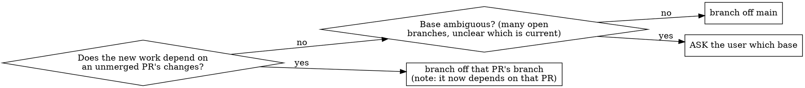

# Issue-Driven Git Workflow

## Overview

Every change — feature, bug, or enhancement — travels the same path:

```
issue  →  branch off main  →  continuous commits  →  PR that closes the issue
```

The issue is the *why*, the branch is the *workspace*, the commits are the
*steps*, and the PR is the *audit trail* that ties it back to the issue and
merges to main.

**Two principles do the heavy lifting:**
- **Nothing ships unlinked.** Every PR traces to an issue it closes; every
  issue states a problem and a proposed solution before code is written.
- **Branch off main, stay independent.** Basing on `main` lets PRs merge in
  any order. When the base is ambiguous, ask — don't guess.

## When to use

- Starting any feature, bug fix, or enhancement in a git repo.
- Opening a branch, committing, or opening a PR.
- Several PRs are open and you need to pick the next branch to base on.

**Not for:** throwaway spikes you'll never merge; repos where the user has
declared a different convention (their instruction wins).

## The loop

1. **Issue first.** Before writing code, file a GitHub issue: the **problem**
   and a **proposed solution** (and scope/checklist for anything non-trivial).
   This is the unit of work everything else references. `gh issue create`.
2. **Branch off main.** Sync `main`, then branch from it
   (`git checkout main && git pull && git checkout -b <type>/<slug>`). Prefer
   `main` so the PR is independent and can merge in any order. **Ask the user
   which base when it's ambiguous** — see the decision below.
3. **Commit continuously, by logical step.** Each commit is one coherent,
   verified step (see the cadence rubric). Conventional-commit messages
   (`feat:`, `fix:`, `docs:`, `refactor:`, `test:`, `chore:`). Don't batch a
   whole PR into one giant commit, and don't commit broken intermediate state.
4. **Verify before each commit.** Tests/build/type-check green for what the
   commit touches; run the secret scan. A commit is a checkpoint you'd be
   happy to be interrupted at.
5. **PR that closes the issue.** Open the PR with `Closes #N` in the body so
   merging auto-closes the issue. The body is the audit trail: what changed,
   why, how it was verified, and a test plan. One PR per issue.
6. **Keep PRs independent.** Because each branched off `main`, open PRs merge
   in any order. When several are open, pick the **least-conflict** next branch
   (fewest overlapping files with the unmerged PRs).

## Branch-base decision



Default is **main**. Only stack on another branch when the work genuinely
needs that branch's unmerged changes — and say so in the PR. When in doubt,
ask rather than picking a base that creates a surprise dependency.

## Commit cadence rubric (the scale)

Commits happen **continuously**, sized to the work — not one dump at the end:

| PR size | Commits | Shape |
|---|---|---|
| Small (one file / one fix) | 1–2 | the change, maybe a follow-up tidy |
| Medium (a few files, one concern) | 2–4 | one per logical step (impl, tests, docs) |
| Large (multi-phase feature) | one commit **per phase** | each phase compiles + tests green on its own |

Rule of thumb: if you can describe a commit's purpose in one conventional-commit
subject line without "and", it's the right size.

## PR body checklist

- [ ] `Closes #<issue>` (or `Fixes`/`Resolves`) so the merge closes the issue.
- [ ] **What changed** — the substance, not a file list.
- [ ] **Why / decisions** — anything a reviewer would otherwise have to ask.
- [ ] **Verification** — tests run, build, type-check, secret scan.
- [ ] **Test plan** — checkboxes for manual steps where relevant.

## Common mistakes

| Rationalization | Reality |
|---|---|
| "It's a tiny change, skip the issue" | The issue is the link a PR closes. File it; it can be one line. |
| "I'll just branch off whatever's checked out" | That silently couples your PR to someone else's unmerged work. Branch off main or ask. |
| "One big commit at the end is cleaner" | It's unreviewable and unrevertable. Commit per logical step. |
| "I'll write the PR body later" | The body is the audit trail. Write it from the commits while they're fresh. |
| "Mention the issue in a comment" | Use `Closes #N` in the PR body so the merge actually closes it. |
| "All my PRs touch the same files anyway" | Then sequence them: pick the least-conflict next branch, or stack deliberately and say so. |

## Red flags — stop

- About to commit without running the relevant tests/build.
- About to open a PR that references no issue.
- Branching off a non-main branch without a stated reason.
- A single commit that spans unrelated concerns (needs "and" to describe).
- Committing secrets / personal data (run the scan first).
