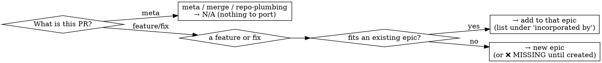

# Mapping PRs to Migration Issues

## Overview

Turn a **source** repo's merged-PR history into a **target** repo migration **backlog**: a set of
**epic issues** (features/themes grouped from the PRs) plus one **INDEX issue** that maps *every*
source PR → the epic(s) that will incorporate it. The index is a live tracker with explicit coverage —
covered / ❌ MISSING / N/A — so the migration can be worked **step by step** and no PR is ever lost.

This is the **planning** step. It creates issues; it does **not** port code. Once the backlog exists,
each epic is developed via [`issue-driven-git-workflow`](../issue-driven-git-workflow/SKILL.md) and the
code is ported via [`migrating-between-codebases`](../migrating-between-codebases/SKILL.md).

**Two principles do the heavy lifting:**
- **Every source PR is accounted for.** Each merged PR maps to an epic, `MISSING` (a gap → new epic),
  or `N/A` (a meta/merge commit with nothing to port). Nothing is silently dropped.
- **The index is the single source of truth.** One issue tracks all PR→epic coverage; re-run it to
  refresh as epics are created and closed. Memory drifts; the index doesn't.

## When to use

- Standing up a migration/port between two separate GitHub repos (fork → public, diverged repos,
  vendoring a feature set) and you want a trackable, reviewable backlog before touching code.
- You have a pile of merged PRs on one side and need to decide *what becomes which issue* on the other.

**Not for:** a single-PR port (just open one issue); repos that still share git history
(`git merge`/`cherry-pick`); non-GitHub trackers (the runbook is `gh`-based — adapt the commands).

## Inputs

- **`source`** and **`target`** — two GitHub repos (`owner/repo`), with `gh` authenticated for both.
- Optional **grouping hints** — known feature areas or folder→epic mappings to seed the clustering.
- No secrets. Issue bodies reference **GitHub permalinks** (PRs, plan files), never local paths or
  personal data — the source repo may be public.

## The runbook

1. **Inventory every merged source PR.** `gh pr list --repo <source> --state merged --limit 300 --json
   number,title,mergedAt`. For each, get the folders it touched: `gh pr diff <n> --repo <source>
   --name-only` → reduce to top-level dirs. Record each PR in `pr-inventory.template.md` with a
   one-line description + a theme. Re-runnable; nothing skipped. *(Squash-merged PRs sometimes return
   an empty diff — fall back to `gh pr view <n> --repo <source> --json files` or the merge commit.)*
2. **Cluster PRs into epics.** Group by feature/theme/folder into **coherent epics** — often *many small
   PRs → one epic* (e.g. three linkifier fixes → one "path linkifier" epic), occasionally one big PR
   spanning two. Run each PR through the gate below. Give each epic a **direction** (`port-out` = exists
   in source, add to target / `port-in` = the reverse), an **effort** (S/M/L), and an area.
3. **Create one epic issue per cluster** in the target — `gh issue create --repo <target>` from
   `epic-issue.template.md`: title `N. <Area>: <Feature>`, body = direction + effort + **source PR/issue
   refs** + description/gap + a porting **checklist** (the concrete modules/files to bring over), labels
   `epic` + area + direction. **Capture the returned issue numbers** — the index needs them.
4. **Create the INDEX issue** in the target — `gh issue create --repo <target>` from
   `index-issue.template.md`: the `PR | description-short | folders | incorporated-by` table, a
   **coverage** line (N covered / M MISSING / K N/A), a legend, and the epics list.
5. **Close the coverage loop.** Walk the inventory: every PR is `→ #epic`, `❌ MISSING`, or `N/A`.
   For each `MISSING`, create a new epic (step 3) and update the index. **Assert 0 unexplained gaps**
   before you call it done.
6. **Keep the index current.** As epics are built and closed, re-run to refresh coverage. Hand each
   epic to `issue-driven-git-workflow` (branch off main → PR closes the epic) and port its code with
   `migrating-between-codebases`.

## Cluster gate (per PR)

Prefer **fewer, coherent epics** over one-issue-per-PR: an epic is a *shippable unit of the target*,
not a mirror of the source's commit granularity. The index preserves the per-PR detail.

## Output shapes

- **Epic issue** — see `epic-issue.template.md`. Every epic carries its **source refs** (so the porter
  knows exactly what to read) and a **checklist** of files/modules (so progress is visible).
- **INDEX issue** — see `index-issue.template.md`. One table row per source PR; the `incorporated by`
  column is the whole point — the map from *what shipped there* to *what you build here*.

## Common mistakes

| Rationalization | Reality |
|---|---|
| "One issue per PR is cleanest" | You'll drown in 30 tiny issues. Cluster into shippable epics; the index preserves per-PR granularity. |
| "This PR is obviously covered — skip it in the index" | Then it's invisible. Every PR gets a row, even if `N/A`. |
| "I'll remember which PRs are left" | You won't. The index is the source of truth — `MISSING` is a first-class state. |
| "Folders don't matter for the issue" | They scope the port. Record them — the porter reads them first. |
| "I'll add the source PR ref later" | An epic with no source refs is unportable. Put them in at creation. |
| "The index can lag reality" | A stale index is worse than none — it hides gaps. Re-run it. |

## Red flags — stop

- A source PR with **no row** in the index.
- An **epic no PR maps to** (invented scope — delete it, or find its PRs).
- A **local path / personal data** in an issue body (use GitHub permalinks).
- Creating epic issues **before the inventory is complete** (you'll mis-cluster).

## Worked example

`reck-stationd-linux` (fork, feature-ahead) → `reck-connect` (public). 17 merged fork PRs became
epics **#1–#16** plus the **INDEX #14**. Coverage: **0 MISSING**. `#25` ("combine the repos") = **N/A**
(meta-merge, nothing to port). The three small linkifier PRs (`#27`, `#29`, `#35`) all cluster into the
single **#1** file-viewer/linkifier epic — *many PRs → one epic*. Two uncovered PRs (`#34`, `#21`)
surfaced as gaps and spawned new epics (`#15`, `#16`). Each epic links a PR-ready plan file (permalink
into the source) and is then executed with `migrating-between-codebases`.

## Related skills

- [`migrating-between-codebases`](../migrating-between-codebases/SKILL.md) — **executes** each epic
  (the actual copy / reconcile / scrub / verify port). This skill produces the backlog it consumes.
- [`issue-driven-git-workflow`](../issue-driven-git-workflow/SKILL.md) — the per-epic dev loop
  (issue → branch off main → commits → PR that closes the epic).

## Templates

- `pr-inventory.template.md` — the working ledger (every source PR, its folders, theme, target epic).
- `epic-issue.template.md` — the epic-issue body shape.
- `index-issue.template.md` — the INDEX-issue body shape (the migration tracker).
