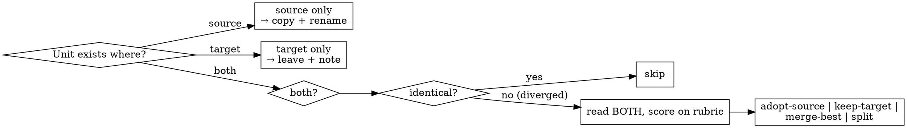

# Migrating Between Codebases

## Overview

Porting code between two copies of the **same project that no longer share git history**, so `git merge` / `cherry-pick` can't help. It is a **copy-based reconciliation**: for each unit you compare both sides, decide adopt / keep / merge / discard, copy what wins, rewrite identity, scrub personal data, strip migration cruft, and verify it builds — then move on.

**Two principles do the heavy lifting:**
- **Verify before you overwrite** — the target is *sometimes the better version*. This is bidirectional, never a blind one-way copy.
- **Leave the code cleaner and self-explanatory, not more complex** — real docstrings in, migration history out.

## When to use

- Syncing a downstream fork with upstream (or vice versa) after the histories diverged.
- Consolidating two repos that drifted from a common ancestor.
- Vendoring / extracting a self-contained module into another project.
- Symptoms: "just copy the folder over", files that *both* sides changed, "which version is better?".

**Not for:** repos that still share history (use `git merge`/`cherry-pick`); brand-new code (nothing to port from).

## Setup: a migration config (lives in the consuming repo, never in this skill)

Read a small per-migration config the user supplies. See `migration-config.example.yaml`. It declares:

- `source` / `target` — the two trees. **Keep BOTH checked out side by side** and keep referencing the source as you work.
- `rename` — identity map applied on copy (module path, package name, import alias) so a copy compiles in the target.
- `scrub` — regex/literals for personal data (usernames, hostnames, IPs, home paths, emails, tokens).
- `exclude` — globs never to copy (`node_modules`, `dist`, secrets).

## The runbook

1. **Inventory + ledger.** List the source units; record each in the ledger (`migration-report.template.md`) with a *state* and a *decision*. Re-runnable; nothing silently skipped.
2. **Per-unit decision (the comparison gate).** Decide BEFORE copying — see flowchart.
3. **Copy + identity-rewrite.** Copy the winning version; apply the `rename` map.
4. **Sanitize.** Apply `scrub` patterns + a secret scan; the tree must be clean of personal data BEFORE commit.
5. **Doc hygiene.** Apply the comment taxonomy below. Migration narrative goes in the report, never in code.
6. **Deps + tests.** Bring the unit's dependencies (reconcile versions) and its tests (sanitized).
7. **Verify — don't just copy.** Build + type-check + lint + the unit's tests pass in the TARGET before the next unit.
8. **Bounded cleanup.** Readability only — see anti-over-engineering.
9. **Commit clean.** `port: <unit> from <source>` — reference the report, not the source's dead issues.

## Per-unit decision (the comparison gate)

For a **diverged** unit you MUST read both versions and score before writing:

- **Correctness** — which actually works / fixes the bug?
- **Recency** — which has the later fixes?
- **Tests** — which is better specified?
- **Readability** — which is simpler (without over-engineering)?
- **Completeness** — which handles more cases?

Then record the outcome in the report: **take-source** · **keep-target** (discard the source change — note it so it isn't re-evaluated next run) · **merge** (best of each, e.g. source's logic + target's error handling) · **split** (some files each).

**Never overwrite the target blind. The "source of truth" is whichever side is better for THIS unit.**

## Doc hygiene — comment taxonomy

Ported code carries ONLY these comments (this is the shape to produce, not a vague "clean it up"):

- **File header** — one line: what this file is responsible for.
- **Docstrings** on public functions/classes — what it does, params, returns, errors/edge cases.
- **Why-comments** — non-obvious rationale, invariants, gotchas.

KILL on the way in (they reference a history the target doesn't have):

- Issue/PR references (`#39`, `fixes #32`, `see PR #40`).
- Migration narrative (`ported from…`, `deviation note`, `previously we…`, `changed X → Y`).
- Dated / changelog / LEARNINGS-style asides.

The "what changed and why" story lives in the **migration report**, not in source files.

## Sanitization

Scrub every copied file against the config's `scrub` patterns, then run a secret scan (`gitleaks` / `git-secrets`, or a regex pass) over the staged copy. Common leaks: `/home/<user>`, `/Users/<user>`, hostnames, tailnet/CGNAT IPs, emails, API tokens. Clean BEFORE commit — a personal path or token in a public repo is the exact failure this skill exists to prevent.

## Anti-over-engineering guard

Cleanup is **readability only and behavior-preserving**: better names, delete dead code, split a file that has grown too large.

**STOP** if you catch yourself: adding a base class / abstraction layer, generalizing for hypothetical reuse, introducing a config system, or renaming across the whole codebase. "While I'm here" is how a clean port becomes a rewrite.

## Common mistakes

| Rationalization | Reality |
|---|---|
| "Source is canonical — just overwrite the target" | The target may be ahead. Read both; decide per unit. |
| "They look the same, take source" | Diff them. A small diff can hide the better fix. |
| "Keep the `#39` comment for context" | That issue doesn't exist here. Move it to the report or drop it. |
| "I'll refactor while I port" | Port first, behavior-preserving. Refactoring is a separate pass. |
| "I'll sanitize at the end" | You'll miss some. Scrub per file + scan before commit. |
| "It copied, so it works" | Build + test in the target. Copy ≠ integrates. |

## Red flags — stop

- About to overwrite a target file you haven't read.
- Pasting a comment containing `#<number>`, "PR", "ported", or a date.
- Adding an abstraction the source didn't have.
- Committing without a secret scan.
- A `/home/` or `/Users/<name>` path in a copied file.

## Worked example

`reck-stationd-linux` (Linux/Pi fork, ahead on features) → `reck-connect` (public, macOS, sometimes cleaner). TypeScript copied verbatim; Go needed the module-path rename. Diverged units (the env-var config contract, the mount watchdog) were *reconciled, not overwritten* — some kept the target's version because it was newer. Personal data (`strijders`, `cyborgstudio`, tailnet IPs, `/home/strijders`) scrubbed. The "what/why" narrative went into a tracking issue + report — never into code comments.

## Templates

- `migration-config.example.yaml` — the per-migration config.
- `migration-report.template.md` — the ledger table + decision log (the audit trail).
